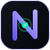

<div align="center">



# Noxis

**Your mind, end-to-end encrypted.**

A sovereign second brain. Notes are encrypted in your browser, stored on
**0G Storage**, and queried with verifiable **0G Compute**. No one but you holds
the key.

Built for [**The Zero Cup**](https://0g.ai/arena/zero-cup) — 0G's global vibe-coding tournament.

</div>

---

## The idea

Most AI note apps ship your private thoughts to a server in plaintext. Noxis
flips that: your passphrase derives an AES-256 key **in the browser**, every note
is encrypted before it leaves your device, and the ciphertext is persisted on the
**0G decentralized storage network**. When you ask a question, only the relevant
encrypted memories are decrypted locally and reasoned over by **0G Compute** —
TEE-attested inference whose output is verified on-chain.

> Your keys, your storage, your compute. Sovereign by construction.

## How it uses the 0G stack

| Layer | What Noxis does | SDK |
|-------|-----------------|-----|
| **0G Storage** | Every note is encrypted client-side, then uploaded as an opaque blob addressed by a Merkle root hash. Notes can be re-fetched and decrypted directly from the network ("pull from 0G"). | `@0glabs/0g-ts-sdk` (`MemData`, `Indexer`) |
| **0G Compute** | Questions are answered by paid, **TEE-verifiable** inference. Each response is checked with `processResponse()` and shown with a `✓ TEE-VERIFIED` badge. Paid from an on-chain ledger. | `@0glabs/0g-serving-broker` |
| **0G Chain (Galileo)** | Settlement for storage submissions and the compute ledger. Root hashes / tx hashes link out to the explorers. | `ethers` v6 |

## Architecture

```
Browser (client)                         Next.js API (server, holds funded key)        0G Network
─────────────────                        ──────────────────────────────────────        ──────────
passphrase ── PBKDF2 ─▶ AES-256 key
note ──── encrypt (AES-GCM) ──▶ ciphertext ──▶ /api/storage/upload ─── MemData ─────▶ 0G Storage
                                  ▲                                    rootHash,tx  ◀──┘
local encrypted index (localStorage)
question ─▶ local RAG select ─▶ decrypt top-k ─▶ /api/chat ── broker.inference ──▶ 0G Compute (TEE)
                                                  verified answer  ◀───────────────────┘
```

- **The master key never leaves the browser.** The server only ever sees ciphertext
  (for storage) and the small decrypted snippets you explicitly ask about (for inference).
- **The funded private key never reaches the browser.** It lives only in server-side
  API routes (`ZG_PRIVATE_KEY`) and pays for storage + compute.

## Signature interactions

- **Decrypt animation** — text resolves out of cipher glyphs, on theme.
- **Storage receipts** — every saved note shows its `root` + `tx` with explorer links and a live byte count of the ciphertext.
- **Pull from 0G** — re-download the ciphertext from the network and decrypt it, proving decentralized retrieval (not just local cache).
- **Verifiable answers** — `✓ TEE-VERIFIED` pill + the model/provider that produced each answer, with `[n]` citations back to the source memories.

## Run locally

```bash
npm install
cp .env.example .env.local   # add your funded 0G testnet key
npm run dev                  # http://localhost:3000
```

### Environment

| Var | Description |
|-----|-------------|
| `ZG_PRIVATE_KEY` | **Server-only.** Funded 0G testnet key. Pays for storage + compute. |
| `ZG_EVM_RPC` | 0G Galileo RPC (default `https://evmrpc-testnet.0g.ai`). |
| `ZG_INDEXER_RPC` | 0G Storage indexer (default `https://indexer-storage-testnet-turbo.0g.ai`). |
| `ZG_COMPUTE_PROVIDER` | Inference provider address (default = qwen-2.5-7b-instruct). |
| `ZG_LEDGER_OG` / `ZG_PROVIDER_OG` | Funding amounts. Contract minimums: ledger ≥ 3 OG, provider ≥ 1 OG. |

### Funding

Get testnet OG from the [0G faucet](https://faucet.0g.ai) for the wallet behind
`ZG_PRIVATE_KEY`. Fund it with **~5 OG** (3 for the compute ledger + 1 for the
provider sub-account + gas). On first query, Noxis lazily creates the ledger,
acknowledges the provider, and funds it.

## Privacy model — honest version

Encryption is real and client-side; the server cannot read your notes at rest.
The one place plaintext is involved is **inference**: the snippets relevant to a
question are decrypted in your browser and sent through the server to 0G Compute,
because the model has to read them to answer. Everything at rest — local and on
0G — is ciphertext under a key only you hold.

## Stack

Next.js 15 · React 19 · TypeScript · Tailwind · Framer Motion · WebCrypto ·
ethers v6 · `@0glabs/0g-ts-sdk` · `@0glabs/0g-serving-broker`

---

<div align="center">
<sub>Noxis · encrypted second brain · 0G Storage + 0G Compute</sub>
</div>
